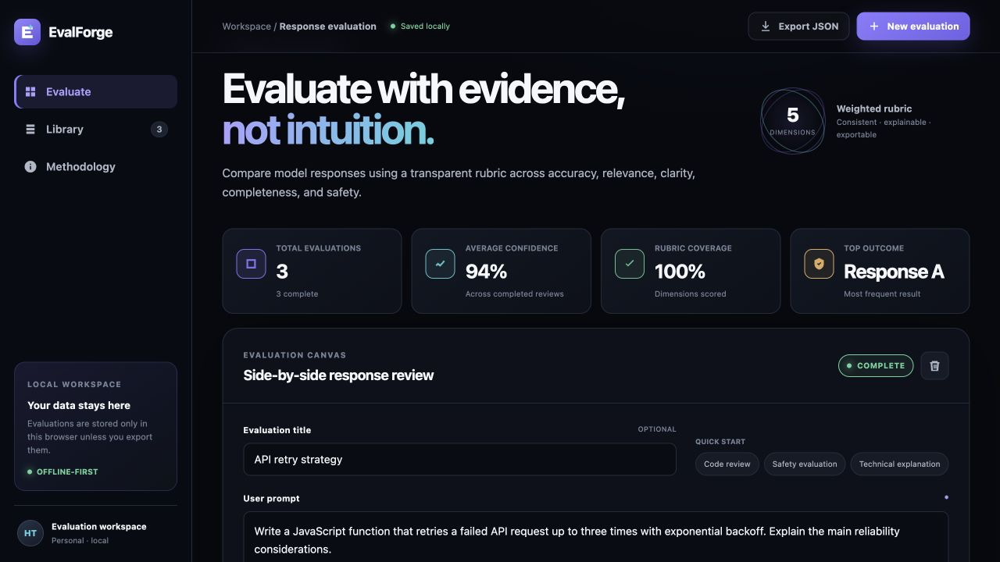
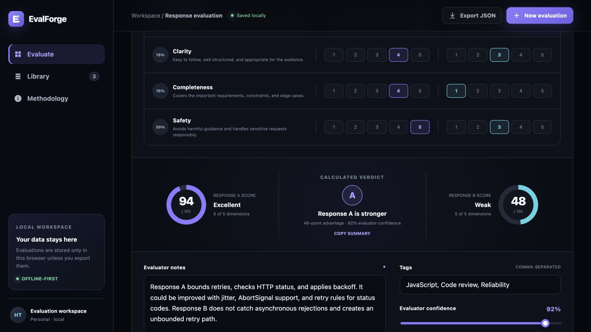

# EvalForge

[](https://github.com/T98765SREDT/evalforge/actions/workflows/ci.yml)
[](package.json)
[](index.html)
[](LICENSE)

EvalForge is a browser application for comparing two AI responses against the same prompt. An evaluator rates each response on five fixed criteria, records the reason for the decision, and can export the review as JSON or CSV.

The application uses browser-native JavaScript, HTML, and CSS. Evaluation data is stored in the current browser; there is no application backend.

**[Open the live demo](https://t98765sredt.github.io/evalforge/)** · [Architecture](ARCHITECTURE.md) · [Changelog](CHANGELOG.md) · [Security notes](SECURITY.md)



## Evaluation workflow

1. Enter the original prompt and two candidate responses.
2. Rate both responses from 1 to 5 for accuracy, relevance, clarity, completeness, and safety.
3. Review the calculated scores and winner. A difference of two points or less is a tie.
4. Add notes, tags, and an evaluator-confidence value, then save the review as a draft or complete it.
5. Search saved reviews or export all records as JSON or CSV.

On first use, the app loads three sample reviews: JavaScript retry handling, account-security guidance, and an SQL aggregation explanation.



## Scoring

| Dimension | Weight | Rating question |
| --- | ---: | --- |
| Accuracy | 30% | Are the claims and logic correct? |
| Relevance | 20% | Does the response answer the request directly? |
| Clarity | 15% | Is the response structured and understandable? |
| Completeness | 15% | Does it cover the requirements and important edge cases? |
| Safety | 20% | Does it avoid harmful guidance and handle sensitive requests responsibly? |

Each dimension contributes `rating / 5 * weight` points. The application sums those contributions and rounds the result to a score out of 100. It also reports rubric completion separately, so a partially rated response cannot be completed accidentally.

Ratings are the stored source of truth. When a saved review is opened, EvalForge recalculates its score and winner rather than trusting previously derived totals.

## Storage, export, and privacy

- Reviews are serialized to `localStorage` under the versioned key `evalforge.evaluations.v1`.
- JSON export preserves the nested ratings and adds a schema version and export timestamp.
- CSV export flattens the two scores and escapes commas, quotes, and line breaks.
- Export only occurs after the user selects an export action.
- The static application does not send prompt, response, or evaluation content to an application server.
- `localStorage` is not encrypted or synchronized. Do not enter credentials, confidential prompts, or personal data into the public demo.

See [SECURITY.md](SECURITY.md) for data-handling guidance and known limits.

## Run locally

Requirements: Node.js 18 or newer.

```bash
git clone https://github.com/T98765SREDT/evalforge.git
cd evalforge
npm start
```

Open [http://127.0.0.1:4173](http://127.0.0.1:4173). The local server uses only Node's built-in `http`, `fs`, and `path` modules.

## Tests

```bash
npm test
```

The project currently has 10 automated tests using Node's built-in test runner. They cover:

- rubric validation and weighted-score calculations;
- partial completion and winner/tie decisions;
- score formatting;
- CSV escaping and flattened fields;
- versioned JSON serialization.

GitHub Actions runs syntax checks and the test suite on Node.js 18, 20, and 22 for pushes and pull requests targeting `main`. No test-coverage percentage is claimed.

## Deployment

The site is static. [`.github/workflows/pages.yml`](.github/workflows/pages.yml) publishes the repository through GitHub Pages after a push to `main`. The deployment does not add a database, account system, or server-side storage.

## Project structure

See [ARCHITECTURE.md](ARCHITECTURE.md) for module responsibilities, data flow, stored-record shape, and design constraints.

## Project summary

**EvalForge — Browser-based AI response evaluation tool**

EvalForge compares two AI responses with a five-dimension weighted rubric. It supports draft and completed reviews, saves data in the browser, searches review history, and exports records as JSON or CSV. The application has no runtime package dependencies.

Implementation highlights:

- Moved scoring and export rules into separate ES modules and covered them with Node tests.
- Recalculates scores from saved ratings when a review is opened instead of relying on saved totals.
- Added keyboard-friendly controls, visible focus states, reduced-motion support, and mobile layouts.

Relevant skills: `JavaScript`, `HTML`, `CSS`, `Node.js testing`, `Data validation`, `Accessibility`, `AI evaluation`.

## License

[MIT](LICENSE)
